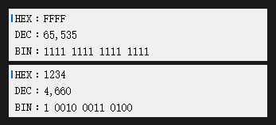

# 简易计算器

去掉键盘,仅保留数字显示区域,占用更小的空间

## 进制显示

-   16 进制
-   10 进制
-   2 进制

## 快捷键

-   `ESC` 退出
-   `N` 或 `n` 垂直新建窗口
-   `S` 或 `s` 显示所有窗口
-   `Tab` 切换到下一个窗口
-   `Delete` 清空
-   `Backspace` 退格
-   `Enter` 或 `=` 计算
-   `Ctrl + N` 水平新建窗口
-   `Ctrl + S` 保存窗口
-   `Ctrl + O` 加载窗口
-   `Ctrl + G` 关闭所有窗口
-   `Ctrl + C` 复制
-   `Ctrl + V` 粘贴
-   `↑` 切换上一个进制
-   `↓` 切换下一个进制

## 运算符

-   `+` 加
-   `-` 减
-   `*` 乘
-   `/` 除
-   `%` 取余
-   `&` 与
-   `|` 或
-   `^` 异或
-   `~` 取反
-   `<` 左移
-   `>` 右移